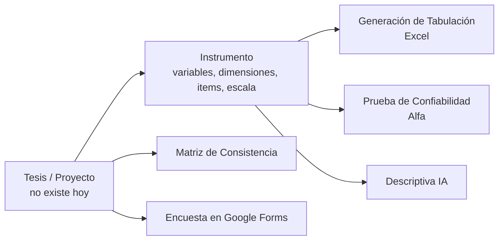

# Auditoría UX de TesisTab (Layers of Product Design)

Fecha: 2026-07-18 · Método: `/layers-orient` de [layers-skills](https://github.com/jamiemill/layers-skills) · Alcance: solo diagnóstico y decisiones recomendadas; nada de esto estaba implementado a esa fecha.

> **Actualización 2026-07-27**: la decisión recomendada #1 (el objeto "Proyecto
> de tesis" con Instrumento compartido) **se implementó** el 2026-07-25
> (`node_app/lib/proyectos/`, `frontend/src/components/sections/ProyectosSection.tsx`).
> La integración es parcial: Tabulación y Confiabilidad leen el instrumento del
> proyecto activo; Títulos y Matriz de Consistencia leen y escriben; Descriptiva
> y Humanizador todavía no participan (Humanizador no usa un instrumento;
> Descriptiva sí debería, pero su entrada es un cuestionario en texto libre, no
> el instrumento estructurado — ver `ESTADO_TECNICO.md`, sección "Proyecto de
> tesis y auditoría de arquitectura"). El resto de este documento (decisiones
> 2-6) sigue sin implementar y sigue vigente como diagnóstico.

**Lectura de diseño**: SaaS para tesistas cuantitativas (Perú, pregrado/posgrado) que convierte una encuesta en el capítulo de resultados. Siete herramientas conectadas por marca, pero no por datos.

## Panorama de decisiones (las 7 capas)

| Capa | Estado | Notas |
|---|---|---|
| Comportamiento observado | **Asumido** | No hay analytics ni registro de investigación con usuarios en el repo. Lo que "sabemos" del uso es intuición del fundador. |
| El dominio | **Fuerte** | El producto codifica bien el dominio real: baremos, Likert, Alfa de Cronbach, matriz de consistencia, formato APA de tablas/figuras. |
| Necesidades de usuario | **Parcial** | Implícitas en las herramientas, no articuladas. Job stories de referencia abajo. |
| Estrategia de producto | **Parcial** | Dos planes claros; el modelo mixto (suscripción por días para Tabulación + usos para Forms) funciona pero la conexión necesidad→negocio es informal. |
| **Modelo conceptual** | **Débil ← cuello de botella** | Ver análisis abajo. |
| Estructura de interacción | **Parcial** | Wizard de 3 pasos sólido. Pero: sin URLs por sección, estados post-acción efímeros, sin historial. |
| Superficie | **Fuerte** | Recién rediseñada (v3 esmeralda) bajo reglas anti-slop. |

## Cuello de botella: el modelo conceptual

El objeto central del dominio, **el instrumento de la tesis** (variables → dimensiones → indicadores → ítems + escala), **no existe como objeto del producto**. Cada herramienta lo pide de nuevo:

- Tabulación lo define en el wizard.
- Confiabilidad vuelve a pedir la matriz.
- Descriptiva vuelve a pedir la estructura.
- Matriz de Consistencia vuelve a pedir variables y dimensiones.

Es el modo de fallo OOUX "Isolated/Broken": el mismo objeto real vive fragmentado en cuatro pantallas sin relación. Consecuencias: retrabajo, inconsistencias entre herramientas (la misma tesis con nombres distintos) y ninguna razón estructural para que el usuario vuelva.

## Job stories de referencia (capa 3)

1. Cuando mi asesor me pide el capítulo de resultados con fecha límite, quiero convertir mis respuestas en tablas y figuras con formato aceptado, para no perder semanas en Excel ni pagar a un estadístico.
2. Cuando el jurado observa mi instrumento, quiero regenerar todo con el cambio (un ítem menos, otra escala) sin reconfigurar desde cero, para responder observaciones en días y no semanas.
3. Cuando uso varias herramientas del sistema, quiero que recuerden mi tesis, para no re-tipear mis variables en cada una.

## Decisiones recomendadas, en orden

1. **Decidir el objeto "Proyecto de tesis" con su Instrumento compartido** (cuello de botella). Una sola definición reutilizada por Tabulación, Confiabilidad, Descriptiva y Matriz; las herramientas pasan de formularios aislados a acciones sobre el proyecto. Es la decisión con mayor impacto en retención y en el job story 2 y 3. → profundizar con `/layers-conceptual-model`.
2. **Decidir semántica post-generación**: ¿una generación de Excel es efímera (hoy: se pierde al navegar) o un objeto con historial re-descargable? El dominio sugiere historial: los tesistas regeneran tras observaciones.
3. **Decidir URLs por sección** (`/app/tabulacion`, `/app/matriz`): hoy `activeSection` es estado en memoria; sin deep-links no hay "volver donde estaba", ni soporte por link, ni métricas por herramienta.
4. **Instrumentar comportamiento observado antes del próximo rediseño**: funnel mínimo del wizard (paso 1→2→3→descarga) y uso por herramienta. Convertir la capa 1 de Asumido a Parcial cambia la calidad de todas las decisiones futuras.
5. **Revisar vocabulario**: "Descriptiva" vs "Tabulación" no se distinguen desde el dominio del usuario (ambas "tabulan"); "Forms" nombra la marca de la herramienta, no el trabajo ("Llenar encuesta"). Decisión de naming pendiente, no urgente.
6. **Estados temporales de los jobs IA**: si el usuario navega durante un job con polling y vuelve, ¿ve el estado? Decidir el post-action state explícitamente (hoy depende de quedarse en la pantalla).

Ninguna de estas decisiones implica rediseñar la superficie actual; son capas de abajo. La recomendación 1 es la única que cambiaría estructura de pantallas si se adopta.
